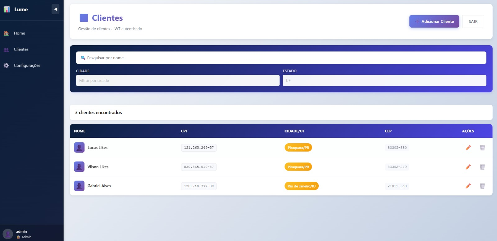
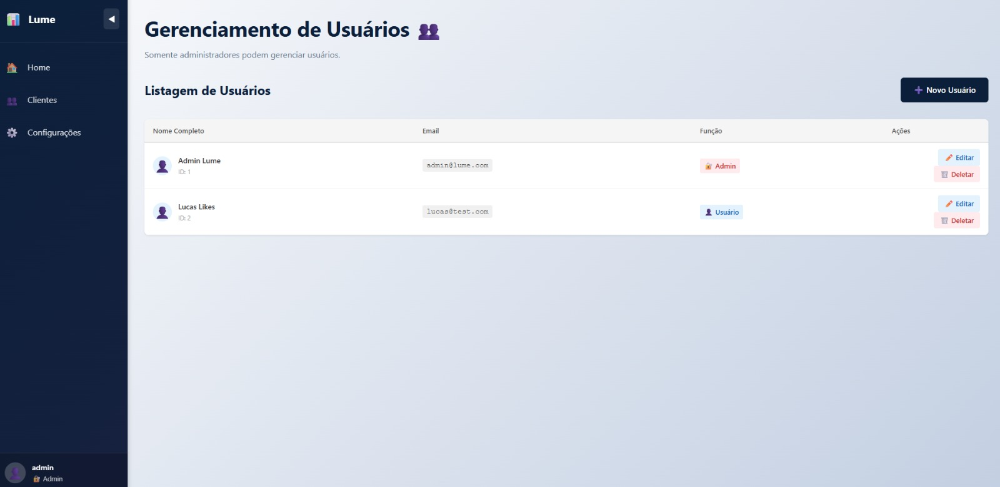
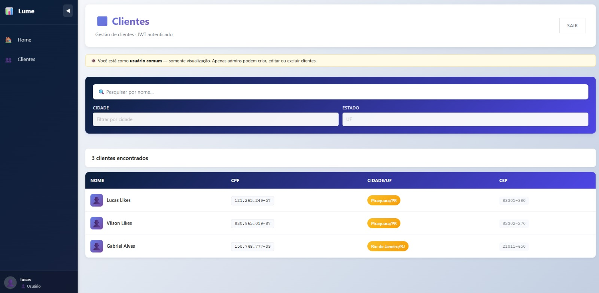
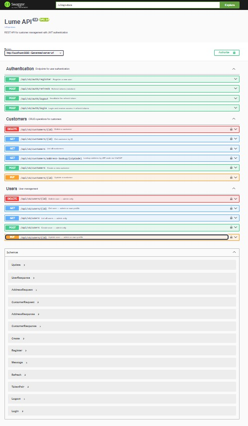

# 🚀 Lume — Sistema de Gestão de Clientes

Sistema fullstack com **autenticação JWT**, **controle de acesso por perfil (RBAC)**, **CRUD de clientes** e **integração com ViaCEP**.

Stack:
- Backend: **Spring Boot 3 (Java 21)**
- Frontend: **React + Vite**
- Infra: **Docker**

---

## 📸 Demonstração da Aplicação

### 👑 Admin — CRUD de Clientes

- Botão **"Adicionar Cliente" habilitado**
- Pode criar, editar e excluir clientes
- Menu **Configurações visível**



---

### 🔒 Admin — Gerenciamento de Usuários

- Apenas usuários com `ROLE_ADMIN` têm acesso
- CRUD completo de usuários
- Controle de permissões



---

### 👤 Usuário Padrão — Somente Visualização

- Não pode criar, editar ou excluir
- Interface adaptada (botões desabilitados)
- Menu de configurações oculto



---

### 📄 Swagger — Documentação da API

- Teste de endpoints direto no navegador
- Autenticação via JWT (Bearer Token)



---

## 🔐 Funcionalidades

### Autenticação
- Registro de usuário com email e senha
- Login com JWT (Access Token + Refresh Token)
- Refresh Token automático com rotação
- Logout com invalidação do token no banco

### Controle de Acesso (RBAC)

| Ação | Admin | Usuário |
|------|-------|---------|
| Visualizar clientes | ✅ | ✅ |
| Criar cliente | ✅ | ❌ |
| Editar cliente | ✅ | ❌ |
| Deletar cliente | ✅ | ❌ |
| Gerenciar usuários | ✅ | ❌ |
| Acessar Configurações | ✅ | ❌ |

> O RBAC é aplicado em duas camadas: `@PreAuthorize` no backend e controle de visibilidade no frontend.

---

## ⚙️ Como Executar

### 🐳 Com Docker (recomendado)

```bash
# Backend
cd lume-api
docker build -t lume-api .
docker run -p 8080:8080 lume-api

# Frontend (em outro terminal)
cd front-react
docker-compose up --build
```

### 💻 Sem Docker

#### Backend
```bash
cd lume-api
.\mvnw.cmd spring-boot:run
```

#### Frontend
```bash
cd front-react
npm install
npm run dev
```

> **Dica:** para rodar o frontend sem o backend, acesse `http://localhost:5173?mock=true`

---

## 🌐 Acessos

| Serviço | URL |
|---------|-----|
| Frontend | http://localhost:5173 |
| Backend | http://localhost:8080 |
| Swagger UI | http://localhost:8080/swagger-ui.html |
| H2 Console | http://localhost:8080/h2-console |

**H2 Console:**
- JDBC URL: `jdbc:h2:mem:lumedb`
- Usuário: `sa` / Senha: _(vazio)_

---

## 🔑 Credenciais de Exemplo

| Tipo | Email | Senha |
|------|-------|-------|
| Admin | admin@lume.com | admin123 |

> O usuário admin é criado automaticamente ao subir o backend.

### Como usar o Swagger

1. `POST /api/v1/auth/login` com as credenciais acima
2. Copie o `accessToken` retornado
3. Clique em **Authorize** (🔐) no topo do Swagger
4. Cole: `Bearer <seu_token>`

---

## 🧪 Testes

O projeto conta com suite completa de **testes unitários e de integração (TDD)**.

### Como rodar

```bash
# Windows
.\mvnw.cmd test

# Linux / Mac
./mvnw test
```

Resultado esperado:
```
Tests run: 72, Failures: 0, Errors: 0, Skipped: 0
BUILD SUCCESS
```

### Cobertura

| Classe de Teste | Tipo | O que cobre |
|-----------------|------|-------------|
| `AuthServiceTest` | Unitário | Register (email duplicado, atribuição de ROLE_USER, encoding de senha), Login (delegação ao AuthenticationManager, BadCredentials), Refresh (rotation, revogação), Logout, deriveNamesFromEmail |
| `CustomerServiceTest` | Unitário | Create (CPF duplicado, mapeamento de endereço), FindById (not found), FindAll (lista vazia), Update (CPF de outro cliente, not found), Delete (not found) |
| `JwtServiceTest` | Unitário | Geração de token, extração de username, validação por usuário, `toClientRole` (ROLE_ADMIN→admin, fallback→user), claims completos, token adulterado, token expirado |
| `CpfValidatorTest` | Unitário | CPFs válidos com/sem formatação, sequências repetidas (000...0 a 999...9), dígitos verificadores errados, tamanho inválido, null, só letras |
| `CustomerControllerIT` | Integração | 401 sem token, 403 para ROLE_USER em mutations, 201/409/400 para admin, 204 delete, 404 not found, guard no address-lookup |
| `AuthControllerIT` | Integração | Register 201/409/400, Login 200/401, Refresh com token rotation, 401 token inválido |
| `ViaCepClientTest` | Unitário | Resposta de sucesso, strip de formatação, fallback parcial em timeout, fallback em null, fallback em payload `{erro:true}` |

### Configuração de teste

Testes de integração usam perfil `test` com banco H2 isolado e DDL `create-drop`, sem interferir no banco de desenvolvimento.

---

## 🏗️ Arquitetura

```
┌─────────────────────────────────┐
│         Frontend (React)        │
│  AuthContext → decode JWT role  │
│  useRbac() → ROLE_ADMIN check   │
│  httpClient → Bearer automático │
└────────────────┬────────────────┘
                 │ HTTP + JWT
┌────────────────▼────────────────┐
│       Backend (Spring Boot)     │
│  JwtAuthenticationFilter        │
│  @PreAuthorize("hasRole(...)") │
│  AuthController / Customer...   │
│  ViaCEP integration             │
│  H2 in-memory database          │
└─────────────────────────────────┘
```

### Estrutura do Backend

```
src/main/java/com/lume/lumeapi/
├── config/           # Security, Bean, Swagger, CORS, DataInitializer
├── controller/       # AuthController, CustomerController, UserController
├── domain/
│   ├── dto/          # AuthRequest/Response, CustomerRequest/Response
│   └── entity/       # User, Customer, Address (Embeddable), RefreshToken
├── enums/            # Role (ROLE_ADMIN, ROLE_USER)
├── exception/        # GlobalExceptionHandler + exceções customizadas
├── integration/cep/  # ViaCepClient, ViaCepResponse
├── repository/       # UserRepository, CustomerRepository, RefreshTokenRepository
├── security/         # JwtService, JwtAuthenticationFilter, UserDetailsServiceImpl
├── service/          # AuthService, CustomerService, TokenService, CepService
└── validation/       # @ValidCpf, CpfValidator
```

---

## 📌 Diferenciais do Projeto

- ✅ Autenticação JWT completa (Access + Refresh Token com rotation)
- ✅ RBAC aplicado no backend (`@PreAuthorize`) e no frontend (visibilidade)
- ✅ Validação de CPF com dígito verificador via annotation customizada `@ValidCpf`
- ✅ Integração com ViaCEP com fallback resiliente (sem 500 em caso de timeout)
- ✅ Suite de testes: 72 testes, unitários + integração, 0 falhas
- ✅ Docker multi-stage (imagem de build separada da imagem de runtime)
- ✅ Swagger documentado com autenticação Bearer
- ✅ H2 Console acessível para debug em desenvolvimento

---